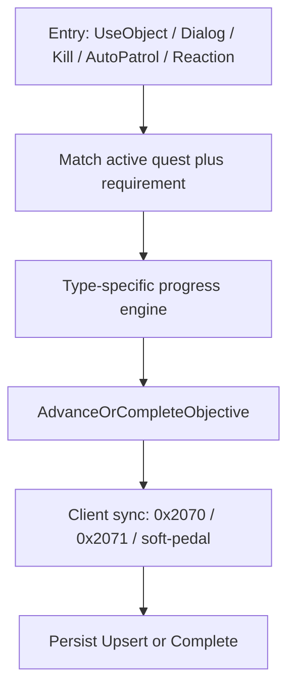

# Mission Handler (canonical)

Single source of truth for **how AutoCore processes missions at runtime**.  
When mission grant/progress/advance/complete behavior changes, update this document in the same change.

Related docs (do not duplicate here):

| Doc | Role |
| --- | ---- |
| [missionState.md](missionState.md) | Client RE, packet byte layouts, Ghidra anchors |
| [missionWork.md](missionWork.md) | Persistence handoff, schema, open live bugs |
| [testing/mission-testing-map.md](testing/mission-testing-map.md) | Test inventory / component cards |
| [testing/mission-invariants.md](testing/mission-invariants.md) | Correctness contracts (I01–I32) |
| [testing/mission-regression-catalog.md](testing/mission-regression-catalog.md) | REG-001…005 defect log |
| [NPC.md](NPC.md) §15.3 | Combat NPC faction so kill targets are hittable |
| [ghostPlan.md](ghostPlan.md) | Vehicle ghost containment (combat targets stay hittable) |

---

## 1. Purpose and authority

- The **server owns** quest state (`CurrentQuests`, progress, completed ids).
- The **client** owns UI, local eval, and some optimistic CompleteObjective behavior on dialog OK.
- There is **no** `MissionHandler` / `MissionManager` class. Runtime ownership is:

| Owner | Responsibility |
| ----- | -------------- |
| `ObjectUseManager` | C2S UseObject (0x2072) dispatch order |
| `NpcInteractHandler` | Dialog offer/accept, deliver/kill turn-in, AutoPatrol, grant, advance/complete, fail, rewards |
| `MissionKillProgress` | Kill / kill_aggregate credit from `OnDeath` |
| `MissionCollectProgress` | Collect kill-to-loot drop + inventory progress |
| `MissionUseItemProgress` | UseItem UseObject matching and progress |
| `MissionPatrolProgress` | Pure multi-pad / sequential / lap encoding for AutoPatrol |
| `MissionWorldPhaseRules` | Prereqs, race/class, sibling deliver, pad helpers |
| `MissionClientSoftPedal` | Suppress/queue 0x206C after dialog turn-in |
| `MissionCargoService` | Grant/take deliver and useitem cargo |
| `MissionPersistence` | DB Upsert / Complete / Failed |
| `Reaction` (mission types) | Map GiveMission / CompleteObjective / FailMission / SetActiveObjective |

**Dispatch is by objective `RequirementType` (GLM), not by template `MissionType`.**  
`Mission.Type` is classification metadata only. Do not assume `MissionType.Collect` implies a collect progress engine.

---

## 2. Taxonomy

### 2.1 `MissionType` (template only)

From `Mission/Mission.cs`. Stored on the template; **not** used as a runtime switch.

| Value | Name |
| ----: | ---- |
| -1 | NonRandom |
| 0 | Destroy |
| 1 | Defend |
| 2 | Escort |
| 3 | Race |
| 4 | Sneak |
| 5 | Spy |
| 6 | Deliver |
| 7 | Collect |
| 8 | Pickup |
| 9 | Craft |

### 2.2 `RequirementType` (runtime dispatch)

From `Mission/Requirements/ObjectiveRequirement.cs`. Status reflects **server progress engines**, not GLM parse alone.

| Id | Name | GLM `type=` | Status | Progress engine |
| -: | ---- | ----------- | ------ | --------------- |
| 0 | Kill | `kill` | **Implemented** | `MissionKillProgress` |
| 1 | KillAggregate | `kill_aggregate` | **Implemented** | `MissionKillProgress` |
| 2 | Collect | `collect` | **Implemented** | `MissionCollectProgress` |
| 3 | Deliver | `deliver` | **Implemented** | Dialog turn-in (`TryCompleteDeliverFromDialog`) |
| 4 | Stunt | `stunt` | Parse-only | None |
| 5 | Money | `money` | Parse-only | None |
| 6 | Mission | `mission` | Parse-only | Prereq-style list on template; not a progress counter |
| 7 | Km | `km` | Parse-only | None |
| 8 | TimePlayed | `timeplayed` | Parse-only | None |
| 9 | Patrol | `patrol` | **Implemented** | AutoPatrol + `MissionPatrolProgress` |
| 10 | CharacterLevel | `characterlevel` | Parse-only | None |
| 11 | CraftItem | *(no factory case)* | Enum-only | Factory returns null |
| 12 | UseItem | `useitem` | **Implemented** | `MissionUseItemProgress` |
| 13 | Escort | `escort` | Parse-only | None |
| 14 | CrazyTaxi | `crazytaxi` | Parse-only | None |
| 15 | Rampage | *(no factory case)* | Enum-only | Factory returns null |
| 16 | Survivor | *(no factory case)* | Enum-only | Factory returns null |

**Parse-only / Enum-only rule:** missions can load and look valid in assets, but the server will never advance those requirements until a dedicated engine + tests exist. Adding a half-wired path is how other mission types regress.

---

## 3. Lifecycle

| Current state | Event | Next state | Side effects | Guards |
| ------------- | ----- | ---------- | ------------ | ------ |
| Not tracked | `Reaction.GiveMission` / `GrantMission` / dialog accept | Active seq=0 | Upsert; cargo; ObjectiveState; journal; world phase | Already active → resync only; completed + non-repeatable → no grant |
| Active | Kill credit | Progress++ or mid-chain advance; final kill-only waits for giver | 0x2071; Upsert | Wrong CBID/COID/faction/template; completed skipped |
| Active | Collect drop / pickup | Drop on death roll; progress from inventory count; final collect-only waits for giver | Ground mission loot; 0x2071; Upsert | Wrong target; pct=0; already at NumToCollect |
| Active | UseItem UseObject | Progress++ or advance/complete | Cargo take; optional world destroy | Wrong target; missing secondary cargo |
| Active | AutoPatrol | Partial pads or advance/complete; or ensure deliver NPC | 0x2071 mid-pad; sibling deliver blocks complete | Wrong pad; out of range when map pos known |
| Active | Deliver / kill / collect turn-in dialog | Advance **or** complete | Soft-pedal; no immediate 0x2070 | Wrong NPC; mid-seq must advance (REG-003) |
| Active | `Reaction.CompleteObjective` | Advance or complete | Shared Advance path; no 0x206C | Objective id must match **active** seq |
| Active | Fail / abandon (C2S or reaction) | Not active; **not** completed | Strip cargo; 0x20B2; delete active DB row | Missing quest → no-op |
| Active final | `AdvanceOrCompleteObjective` | CompletedMissionIds | Rewards; Complete persist; phase replay | Stale quest ref ignored (REG-001) |
| Completed non-rep | GiveMission / offer | Unchanged | No 0x206C re-add | Relog must not re-broadcast grant |

Shared core for finish: **`NpcInteractHandler.AdvanceOrCompleteObjective`**.

---

## 4. Entry points and UseObject order

### 4.1 UseObject (0x2072) — `ObjectUseManager.Handle`

Order is fixed; earlier consumers return and stop fall-through:

1. **UseItem** — `MissionUseItemProgress.TryHandleUseObject`
2. **Mission dialog** — `NpcInteractHandler.TryHandleMissionDialog` → S2C `0x206D`
3. **Interact triggers** — `InteractTriggerService.TryFire`
4. **Vendor store** — `VendorStoreService.TryOpen`
5. **Facilities** — `FacilityOpenService.TryOpen`

Changing this order (especially putting store before mission dialog) breaks Rogers-style turn-in when `Mission.NPC=-1` (REG-004 fall-through symptom).

### 4.2 Other C2S / reaction entries

| Entry | Opcode / type | Handler |
| ----- | ------------- | ------- |
| Mission dialog response | 0x206E | `HandleMissionDialogResponse` — turn-in first, then grant |
| AutoPatrol | 0x20B3 | `HandleAutoPatrol` |
| FailMission (client abandon) | 0x20B2 | `HandleFailMission` → `FailMission` |
| GiveMission | Reaction 30 | `Reaction.HandleGiveMission` |
| CompleteObjective | Reaction 31 | `Reaction.HandleCompleteObjective` |
| FailMission | Reaction 72 | `Reaction.HandleFailMission` → `FailMission` |
| SetActiveObjective | Reaction 60 | Updates sequence + persist (partial UI packets) |
| GiveMissionDialog | Reaction 37 | Client via 0x206C |
| Kill credit | `OnDeath` | `MissionKillProgress.NotifyObjectKilled` |
| Collect drop | `OnDeath` | `MissionCollectProgress.NotifyObjectKilled` |
| Collect progress | ItemPickup | `MissionCollectProgress.SyncProgressFromInventory` |

### 4.3 Offer / grant rules (`CanOfferMission`)

Must pass all of:

- Not already active
- Not completed unless `IsRepeatable != 0`
- NPC match when `mission.NPC > 0` and `npcCbid > 0`
- Level min/max
- Continent when authored
- Race/class (`ReqRace` / `ReqClass` of **-1** = unrestricted; **0** is a real id)
- Prerequisites via `MissionWorldPhaseRules.MeetsMissionPrerequisites` (`RequirementsOred` AND/OR)

`GrantMission`: create `CharacterQuest`, `PopulateFromAssets`, Upsert, `MissionCargoService.EnsureAndSend`, ObjectiveState + journal, `ApplyMissionPhaseWorldState`.

**Quirk:** retail often sends `Accepted=false` on dialog OK; offer path still grants when `CanOfferMission` passes. Packet may carry **objective id** instead of mission id → resolve via `GetMissionByObjectiveId` / `ResolveMissionIdForGrant`.

---

## 5. Per-requirement processing rules

### 5.1 Kill / KillAggregate — **Implemented**

**Engine:** `MissionKillProgress.NotifyObjectKilled` (from `ClonedObjectBase.OnDeath`).

**Match:** CBID, map template COID, faction, and/or vehicle `TemplateId` when `TargetIsTemplateVehicle`. Continent filter when authored.

**Must process as:**

1. Increment `ObjectiveProgress[seq]` (cap at needed / `NumToKill`).
2. Always send **absolute** `0x2071` via `ObjectiveStateBuilder`.
3. Upsert + journal + `OnMissionStateChanged`.
4. If progress &lt; needed → stop (first matching quest only — early return).
5. If progress full and **later sequences exist** → `AdvanceOrCompleteObjective` (mid-chain auto-advance).
6. If **final** and **kill-only** → do **not** complete; wait for giver dialog (`TryCompleteKillTurnInFromDialog` at `mission.NPC`).
7. If **final** and **has non-kill sibling** → do **not** complete on kill alone; deliver/other path finishes.

**Kill turn-in dialog:** soft-pedal (no immediate 0x2070); `IsKillTurnInReady` requires kill-only, full progress, final sequence, NPC = `mission.NPC`.

**Consistency hazards:**

- Completing on last kill for bounty-style missions desyncs client interact state 8.
- Completing on kill when deliver is sibling leaves cargo/turn-in broken.
- Only the first matching active quest gets credit (known product limit).

### 5.2 Deliver — **Implemented**

**Engine:** dialog path — `TryCompleteDeliverFromDialog` after UseObject → 0x206D → 0x206E.

**Match:** active objective has `ObjectiveRequirementDeliver` with `NPCTargetCompletes` and `NPCTargetCBID` == interacted NPC.

**Must process as:**

1. Route through `AdvanceOrCompleteObjective` with `sendCompleteDynamicObjective: false`, `notifyClientRewards: false`, `syncClientImmediately: false`.
2. Arm soft-pedal; schedule delayed follow-up.
3. **Mid-sequence** (later objectives exist) → **advance only** (REG-003). Never remove the whole quest.
4. **Final multi-req** (e.g. patrol+deliver) may force delayed `0x2070` so AutoPatrol waypoints clear.
5. Do not auto-open follow-up offer dialog — player re-interacts.

**`Mission.NPC = -1`:** giver is not on the WAD template. Deliver `TargetNPCCBID` **must** come from GLM Requirements. Load GLM before WAD; `ReapplyMissingMissionGlmXml` backfills empty Requirements (REG-004 Rogers / New Day).

**Dialog item slots:** `BuildDialogItemCoids` carries **reward choice** item COIDs only — never deliver cargo COIDs (client treats non--1 as reward selection).

**World:** turn-in often needs `EnsureDeliverTurnInNpc` / phase Create so the pad NPC exists and is interactable.

### 5.3 Patrol — **Implemented**

**Engine:** `HandleAutoPatrol` (0x20B3) + `MissionPatrolProgress` for multi-pad encoding.

**Match:** active `ObjectiveRequirementPatrol` with `AutoComplete`, target in `GenericTargets`.

**Must process as:**

1. Optional reconcile if client is ahead on a later patrol pad (`ReconcileClientAheadPatrolTarget`).
2. Range-check when map position exists; if no map pos (client-only ghost pads), trust client range gate.
3. If objective has **blocking sibling deliver** → do **not** advance; `EnsureDeliverTurnInNpc` once; return.
4. Multi-pad / multi-lap → `TryApplyMultiPadPatrolHit` until `NeededCount` met; mid-pad updates ObjectiveState, **must not** PushJournal (ratios would freeze tracker).
5. When complete → `AdvanceOrCompleteObjective` (source `AutoPatrol`).

**Encoding (`MissionPatrolProgress`):**

- Sequential: `ObjectiveProgress` = pads accepted (0..needed).
- Non-sequential: packed `(completedLaps << 20) | bitmask` of visited pads this lap.
- `NeededCount` = listed targets × laps.

**Incomplete (logged, not enforced):** Patrol AutoFail, ContinentId gates.

### 5.4 UseItem — **Implemented**

**Engine:** `MissionUseItemProgress.TryHandleUseObject` (first UseObject consumer).

**Match:** PrimaryCOID / PrimaryCBID (and continent); optional SecondaryCBID cargo; optional packet objective id.

**Must process as:**

1. Reject suppressed targets as consumed (no dialog fall-through).
2. Top up `SecondaryGiveAtStart` cargo if missing.
3. Increment progress toward `RepeatCount`.
4. `TakeUseSuccessAndSend`; optional primary world destroy.
5. Partial → absolute UseItem `0x2071` + journal.
6. Full → `AdvanceOrCompleteObjective`; optional `CompletedMission` grant.

### 5.5 Collect — **Implemented**

**Engine:** `MissionCollectProgress` — kill-to-loot drop on death + inventory recount on pickup; giver turn-in via `NpcInteractHandler`.

**GLM fields used:** `CBID` (item), `NumToCollect`, `OptionalDropPercent` (0–100), `OptionalTargetCBID[]`, `ContinentCBID`, `TakeAllItems`, optional target filters.

**Drop (not on procedural loot tables):** On `ClonedObjectBase.OnDeath`, after kill credit:

1. Match active Collect req: victim CBID in optional targets (or template/player filters), continent, `OptionalDropPercent > 0`, `ItemCBID > 0`.
2. Skip if killer already holds `>= NumToCollect` of the item.
3. Roll `random * 100 < OptionalDropPercent` (100 = always).
4. Spawn ground loot via `LootManager.TrySpawnLootItem(..., possibleMissionItem: true)`.

**Progress:** On `ItemPickup`, if CBID matches active Collect item → recount cargo → absolute `0x2071` (same absolute-slot pattern as kill/useitem). Mid-chain auto-advances; final **collect-only** waits for giver dialog.

**Turn-in:** `IsCollectTurnInReady` / `TryCompleteCollectTurnInFromDialog` at `mission.NPC`. Before gating, **recount cargo** into `ObjectiveProgress` (`SyncQuestProgressFromInventory`) — client Collect_Eval uses inventory, and pickup sync can leave progress stale (live Hide and Seek 3668). Soft-pedal like kill turn-in. `MissionCargoService.GetTakeSpecs` removes `NumToCollect` (or all stacks when `TakeAllItems`).

**Non-goals (still incomplete):** `OptionalDropPercent == 0` world/vendor collects; `GiveToAllConvoyMembers`; `QuestItemPickup` (0x205D).

**Retail shape:** Hide and Seek (3668) — 35% hide drop from Marsh Alligrake (12685) → 2× Alligrake Hide (4172) → Jake Detroit (2545).

### 5.6 Escort, CrazyTaxi, Stunt, Money, Km, TimePlayed, CharacterLevel, Mission-req — **Parse-only**

GLM unserialize exists. **No** progress engine. Handler must **not**:

- Call `AdvanceOrCompleteObjective` on unrelated events “to make the mission finish”
- Skip intervening objectives of these types via reconcile helpers (reconcile only skips AutoComplete-only patrol gaps — REG-005)

Until implemented: status stays Parse-only; add engine + tests + this subsection before flipping status.

### 5.7 CraftItem, Rampage, Survivor — **Enum-only**

Present on `RequirementType` but `ObjectiveRequirement.Create` has no case → returns null. Do not add silent factory stubs without progress rules.

---

## 6. Hybrid and multi-requirement rules

`AdvanceOrCompleteObjective` finishes the **whole objective in one call**. It logs `IncompleteHandlerLog` when:

- `Requirements.Count > 1` (treated satisfied without per-req evaluation)
- `CompleteCount > 1` (ignored — single event finishes)

### 6.1 Known special cases (must keep working)

| Shape | Rule |
| ----- | ---- |
| Kill mid-chain → next objective | Auto-advance on kill threshold |
| Final kill-only | Wait for giver dialog |
| Final collect-only | Wait for giver dialog (after inventory count full) |
| Kill + deliver same objective | Kill alone does not finish |
| Patrol + deliver same objective | AutoPatrol does not complete; ensure deliver NPC |
| Deliver mid-sequence | Advance, do not complete mission (REG-003) |
| Deliver → AutoComplete patrol → deliver (Track This) | `TryReconcileAtDeliverNpcDestination` skips AutoComplete-only patrol gaps to next deliver at this NPC; **does not** skip kill/use-item (REG-005) |
| Client objective-id hint | `TryReconcileClientObjectiveHint` only forward-syncs when hint seq is **later** than active |

### 6.2 Consistency checklist (adding a type or hybrid)

Before claiming support for a new requirement or hybrid:

1. Add/extend a **dedicated progress engine** (or dialog/reaction path) — do not overload an unrelated path.
2. Define when progress increments vs when `AdvanceOrCompleteObjective` runs.
3. Define **final vs mid-sequence** behavior.
4. Define sibling interaction (does event A block complete until event B?).
5. Define client sync: immediate 0x2070 vs soft-pedal; absolute vs ratio 0x2071; journal yes/no.
6. Define cargo grant/take and world phase / Create needs.
7. Add regression tests (prefer HeavyRegression for retail shapes).
8. Update **§2.2 status table** and the matching §5 subsection in this doc.
9. Run existing REG / HeavyRegression suites that touch kill, deliver, patrol, useitem, Rogers, Track This.

---

## 7. Client sync contracts

| Packet / behavior | When |
| ----------------- | ---- |
| `0x2071` ObjectiveState | Kill / useitem / multi-pad patrol progress; grant/advance resync |
| Absolute slots | Kill, KillAggregate, UseItem, Collect, multi-pad patrol counts |
| Ratio 0..1 slots | Other authored requirements via `FirstStateSlot` |
| `0x2070` CompleteDynamicObjective | Server-driven advance/complete (kill mid-chain, AutoPatrol, reaction CompleteObjective) |
| **No** immediate 0x2070 | Dialog deliver/kill turn-in (client already ran local CompleteObjective) |
| Soft-pedal (~500ms) | After dialog turn-in — defer 0x206C flush; avoids MSXML AV @ 0x007B6DB0 |
| Delayed 0x2070 | Final multi-req deliver (patrol+deliver) after soft-pedal window |
| Journal PushJournalMissionList | Grant, kill, useitem, immediate advance/complete — **not** mid-pad patrol-only updates |
| `0x20B2` FailMission | Abandon / reaction fail |
| `0x206D` NpcMissionDialog | Offer / turn-in list |
| XP notify | Dialog turn-in often `notifyClientRewards: false` to avoid double XP (REG-001 class) |

---

## 8. Persistence contracts (brief)

| Mutation | Persist |
| -------- | ------- |
| Grant / progress / sequence advance | Upsert active row (`OnQuestChanged`) |
| Final complete | Complete (`OnMissionCompleted`) — active removed, completed set |
| Fail / abandon | Failed / active delete (`OnMissionFailed`) — **not** marked completed |
| Login | Load active + completed; create-packet restore |

Schema, queue, and open live issues: [missionWork.md](missionWork.md).  
Wire layout / RE: [missionState.md](missionState.md).

---

## 9. Retail shapes that must keep working

| Shape | Mission / pattern | Critical rules | Tests |
| ----- | ----------------- | -------------- | ----- |
| New Day / Rogers | 554, `Mission.NPC=-1`, deliver TargetNPCCBID from GLM | GLM-before-WAD; dialog before store; UseObject finds deliver | `MissionRogersUseObjectHeavyRegressionTests`, REG-004 |
| Track This | 3979: deliver → AutoComplete patrol → deliver | Mid-seq deliver advance; destination reconcile; soft-pedal | `NpcInteractUseObjectTests` Track This*, REG-003/005 |
| Live and Direct class | One pad per sequence AutoPatrol | Immediate advance on pad | Heavy patrol / sequence suites |
| LOA class | Multi-pad / laps / sequential | `MissionPatrolProgress` encoding; no early complete | Patrol heavy + unit encoding tests |
| UseItem plant/destroy | Multi-site, RepeatCount, GiveAtStart | UseObject-first; cargo; abandon reclaim | Use-item heavy / coverage tests |
| Kill bounty | Final kill-only | Giver turn-in, not last-kill complete | Kill progress + dialog turn-in tests |
| Hide and Seek class | Collect kill-to-loot (`OptionalDropPercent` + targets) | Mission drop not loot table; absolute progress; giver turn-in recounts cargo (REG-007) | `MissionCollectProgressUnitTests`, `MissionHideAndSeekCollectHeavyRegressionTests` |
| Patrol+deliver sibling | Same objective | AutoPatrol ensures NPC; deliver finishes | Sibling + soft-pedal tests |

Permanent REG catalog: [mission-regression-catalog.md](testing/mission-regression-catalog.md).

---

## 10. File and opcode index

### Source

| Path | Role |
| ---- | ---- |
| `src/AutoCore.Game/Managers/ObjectUseManager.cs` | UseObject dispatch |
| `src/AutoCore.Game/Managers/NpcInteractHandler.cs` | Grant, dialog, deliver/kill turn-in, AutoPatrol, Advance, Fail, rewards |
| `src/AutoCore.Game/Managers/MissionKillProgress.cs` | Kill credit |
| `src/AutoCore.Game/Managers/MissionCollectProgress.cs` | Collect kill-to-loot drop + inventory progress |
| `src/AutoCore.Game/Managers/MissionUseItemProgress.cs` | UseItem |
| `src/AutoCore.Game/Managers/MissionPatrolProgress.cs` | Patrol encoding |
| `src/AutoCore.Game/Managers/MissionWorldPhaseRules.cs` | Eligibility / sibling helpers |
| `src/AutoCore.Game/Managers/MissionClientSoftPedal.cs` | Dialog soft-pedal |
| `src/AutoCore.Game/Managers/MissionPersistence.cs` | DB hooks |
| `src/AutoCore.Game/Mission/Mission.cs` | Template + GLM apply |
| `src/AutoCore.Game/Mission/MissionObjective.cs` | Objectives + requirements |
| `src/AutoCore.Game/Mission/Requirements/*` | Requirement parsers |
| `src/AutoCore.Game/Mission/ObjectiveStateBuilder.cs` | 0x2071 builders |
| `src/AutoCore.Game/Mission/MissionCargoService.cs` | Quest items |
| `src/AutoCore.Game/Entities/Reaction.cs` | Mission reaction types |
| `src/AutoCore.Game/Managers/AssetManager.cs` | GLM-before-WAD; `ReapplyMissingMissionGlmXml` |

### Opcodes

| Opcode | Direction | Meaning |
| ------ | --------- | ------- |
| 0x2072 | C2S | UseObject |
| 0x206D | S2C | NpcMissionDialog |
| 0x206E | C2S | MissionDialogResponse |
| 0x2071 | S2C | ObjectiveState |
| 0x2070 | S2C | CompleteDynamicObjective |
| 0x20B3 | C2S | AutoPatrol |
| 0x20B2 | C2S/S2C | FailMission |
| 0x206C | S2C | GroupReactionCall (soft-pedaled after dialog) |

---

## 11. Incomplete product behavior (known)

| Item | Current behavior |
| ---- | ---------------- |
| Multi-req evaluation | Advance treats all reqs satisfied in one shot (special-cased only where coded) |
| `CompleteCount > 1` | Ignored on advance |
| Per-objective rewards on advance | Logged incomplete — rewards mainly on final complete |
| Multi-mission kill credit | First matching quest only |
| Patrol AutoFail / ContinentId | Not enforced |
| Parse-only / enum-only types (except Collect) | No server progress |
| SetActiveObjective | Sequence + persist; UI packets partial |
| Open live: New Day → Live and Direct after relog | See [missionWork.md](missionWork.md) |

---

## 12. Maintenance contract

This file is the **canonical handler behavior** doc. Keep it accurate:

1. **Any change** to mission progress, grant, advance, complete, fail, requirement parsers, UseObject mission branch, soft-pedal, or reconcile helpers **must** update the matching section here in the same PR.
2. **New requirement support:** flip §2.2 status to Implemented, write a §5 processing subsection, add test pointers, run REG/HeavyRegression for adjacent types.
3. **Status changes** (stub → implemented, parse-only → implemented) update §2.2 and §11.
4. **Do not** invent progress for Parse-only/Enum-only types to “unblock” a retail mission without the checklist in §6.2.
5. Prefer linking to testing/RE docs over copying packet layouts or coverage numbers into this file.

Trace source for this document: implementation under `src/AutoCore.Game` as of the mission handler documentation pass (aligned with REG-001…005 and HeavyRegression suites).
